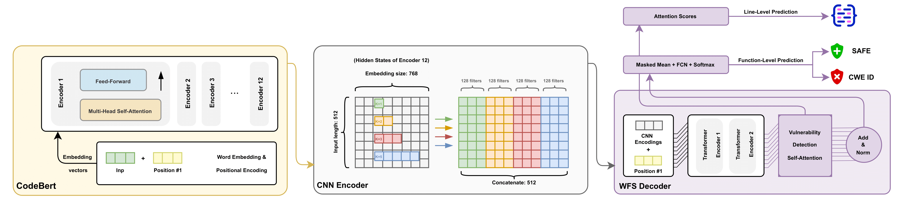
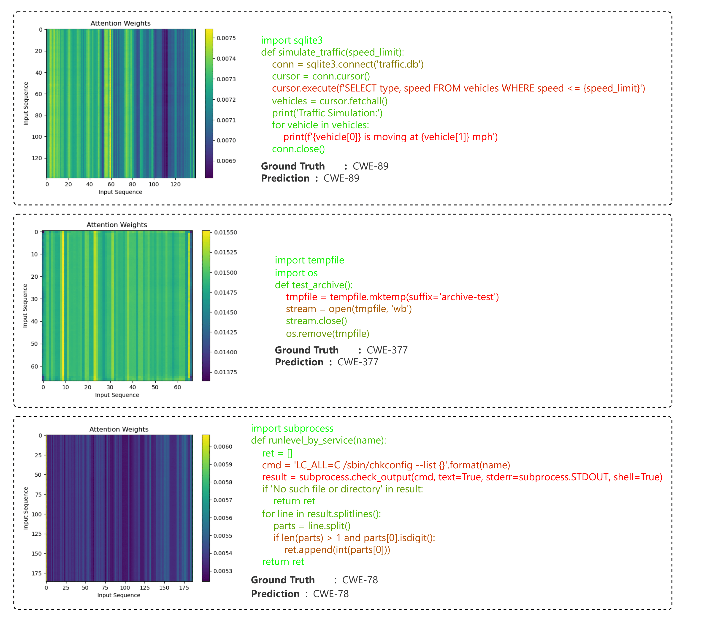
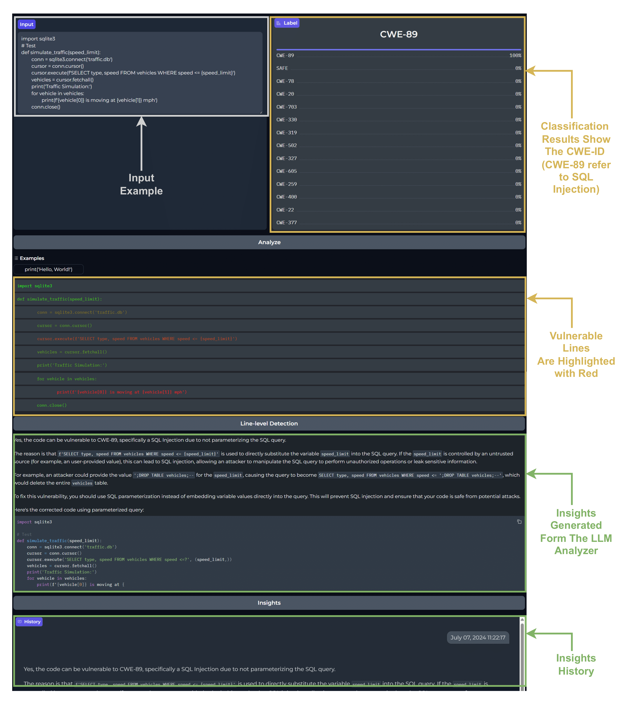

# AEGIS: Transformer-Based Python Vulnerability Detection

This repository contains the dataset and source code for **AEGIS**, a model designed to detect security vulnerabilities in Python code. AEGIS leverages the power of transformer-based models and convolutional neural networks (CNNs) to analyze and classify vulnerabilities at a fine-grained level. This project aims to enhance the security of Python code by automating the detection of common software vulnerabilities.

## Table of Contents
- [Dataset](#dataset)
- [Model Architecture](#model-architecture)
- [Results](#results)
- [Deployment](#deployment)
- [Installation and Usage](#installation-and-usage)
- [Contact](#contact)

## Dataset

The dataset used in this project was carefully gathered from three different sources of Python code:

1. **Open-Source Python Projects**: Extracted from publicly available Python projects hosted on GitHub, ensuring a wide variety of real-world code.
2. ** Curated Python Code Datasets**: We used open-datasets, that contains high-quality, well-structured, and real-world Python code snippets curated specifically for training models on Python code. making it ideal for vulnerability detection.
3. **Synthetic Code**: Generated synthetic Python code samples to replicate common security flaws, focusing on known vulnerability patterns.

### Data Collection Process

1. **Data Filtering**: We ensured that only well-structured and functional code snippets were included in the dataset, prioritizing high-quality code.
   
2. **Function-Level Granularity**: Two versions of the code were collected:
   - **Function-level code only**: Analyzing vulnerabilities in isolated functions.
   - **Function-level code with dependencies**: Incorporating dependencies to provide additional context.

3. **Preprocessing**: The data was preprocessed by removing comments and irrelevant artifacts to ensure the model focused on the functional code.

4. **Labeling**: Vulnerability labels were applied using **Bandit**, a static analysis tool for Python. Bandit detects vulnerabilities like SQL injection, Os Cmd innjection , and cross-site scripting (XSS). If multiple vulnerabilities were found in the same code, the most common one was selected as the label.

## Model Architecture

AEGIS is a multi-stage neural network that combines transformers and CNNs to detect vulnerabilities in Python code with high accuracy.

### Key Components

1. **BERT Layer**: Uses a pre-trained BERT model (`microsoft/codebert-base`) to generate contextual embeddings from the input Python code. These embeddings capture relationships between different parts of the code and serve as the foundation for vulnerability detection.
    - **Embedding Size**: 768

2. **CNN Encoder**: Applies multiple convolutional filters (1x, 2x, 3x, and 5x) to the BERT-generated embeddings to capture patterns at various granularities. This step helps extract both local and global code features.
    - **CNN Filters**: 128

3. **Transformer Encoder (Middle Layer)**: Uses additional transformer encoder layers with self-attention to enhance the extracted features, allowing the model to focus on the most relevant parts of the code for vulnerability detection.
    - **Hidden Size**: 512
    - **Layers**: 2 transformer encoder layers

4. **Decoder**: The final layer uses multi-head self-attention and linear layers to classify vulnerabilities into one of the 14 categories.
    - **Number of Labels**: 14

### Model Parameters
- **Maximum Input Length**: 512 tokens
- **Batch Size**: 16
- **CNN Filter Size**: 128
- **Random Seed**: 42

### AEGIS Model Flow
- The input Python code is tokenized and passed through the BERT layer to generate embeddings.
- These embeddings are processed by the CNN encoder to extract features across different contexts.
- The processed embeddings pass through a transformer encoder layer, allowing the model to attend to different parts of the code.
- Finally, the decoder layer classifies the code into one of 14 possible vulnerability classes.

## Results

AEGIS demonstrates strong performance in vulnerability detection, significantly improving detection rates while minimizing false positives. Key results include:

- **Precision**: 98%
- **Recall**: 98%
- **F1-Score**: 98%

AEGIS achieves fine-grained vulnerability detection and offers robust protection against common Python security threats.

### Line-level Detection Examples

Below is an example of line-level vulnerability detection performed by AEGIS:

## Deployment

We deployed AEGIS using **Gradio**, a simple and interactive interface for running machine learning models in real-time. Gradio allows users to upload their Python code and receive immediate feedback on any detected vulnerabilities.

To deploy and run the model:
1. Clone the repository.
2. Run the `Deployment.ipynb` notebook to start the Gradio app.
3. Upload your Python code sample, and the model will analyze it and display the detected vulnerabilities.

## Contact

For any questions or feedback, please reach out to [Abdechakour Mec](mailto:abdechakourmechri@gmail.com) or connect with me on [LinkedIn](https://www.linkedin.com/in/mechriabdechakour/).
